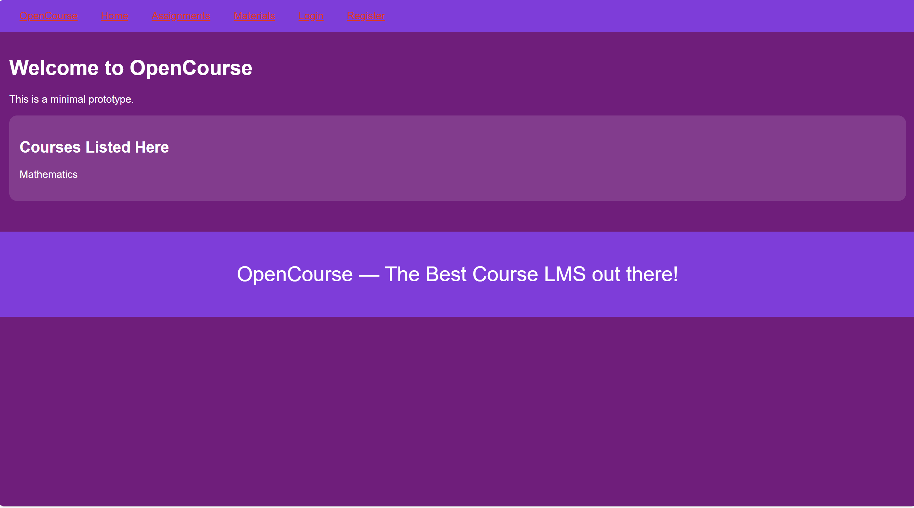

# OpenCourse

Milestone 1 — non-functional Flask-based LMS prototype.

## Installation

1. Create a virtual environment and activate it.

   **Windows (PowerShell):**

   ```powershell
   python -m venv venv
   .\venv\Scripts\Activate
   ```

2. Install all the requirements from requirements.txt

   **Windows (PowerShell):**

   ```powershell
   pip install -r requirements.txt
   ```

3. Run the app

   **Windows (PowerShell):**

   ```powershell
   python run.py
   ```

## Screenshots

1. Home Page
   

2. Assignments Page
   

3. Course Materials Page
   

4.Registration Page

5.Login Page

